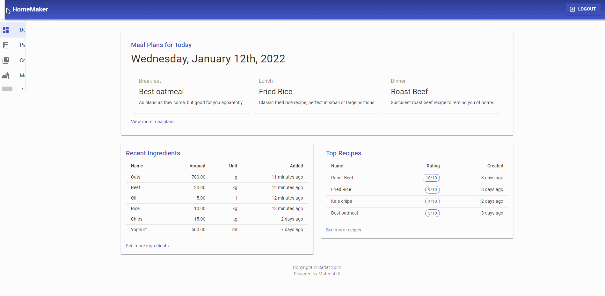
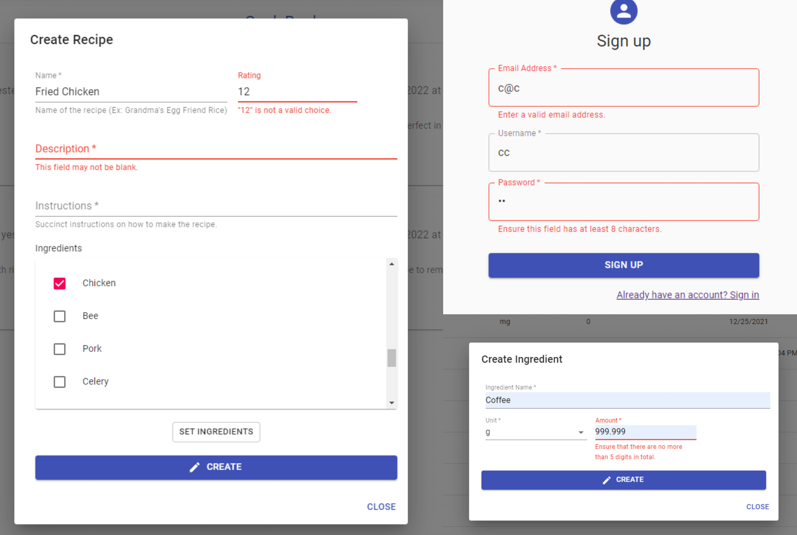

<!--
*** Thanks for checking out the Best-README-Template. If you have a suggestion
*** that would make this better, please fork the repo and create a pull request
*** or simply open an issue with the tag "enhancement".
*** Thanks again! Now go create something AMAZING! :D
***
***
***
*** To avoid retyping too much info. Do a search and replace for the following:
*** github_username, repo_name, twitter_handle, email, project_title, project_description
-->


<!-- PROJECT SHIELDS -->
<!--
*** I'm using markdown "reference style" links for readability.
*** Reference links are enclosed in brackets [ ] instead of parentheses ( ).
*** See the bottom of this document for the declaration of the reference variables
*** for contributors-url, forks-url, etc. This is an optional, concise syntax you may use.
*** https://www.markdownguide.org/basic-syntax/#reference-style-links
-->
<!-- [![Contributors][contributors-shield]][contributors-url] -->
<!-- [![Forks][forks-shield]][forks-url] -->
<!-- [![Stargazers][stars-shield]][stars-url] -->
[![LinkedIn][linkedin-shield]][linkedin-url] ![GitHub issues][issues-url] 
<!-- [![MIT License][license-shield]][license-url] -->


<!-- PROJECT LOGO -->
<br />
<p align="center">
  <a href="https://github.com/shamsow/django-react-homemaker">
    
  </a>

  <h3 align="center">HomeMaker</h3>

  <p align="center">
    One stop solution for home groceries tracking, recipe collecting and meal planning
    <br />
    <br />
    <br />
    <a href="https://raw.githubusercontent.com/shamsow/django-react-homemaker/main/demo.gif">View Full Demo</a>
    ·
    <a href="https://github.com/shamsow/django-react-homemaker/issues/new?assignees=&labels=bug&template=bug_report.md&title=">Report Bug</a>
    ·
    <a href="https://github.com/shamsow/django-react-homemaker/issues/new?assignees=&labels=enhancement&template=feature-addition.md&title=%5BFEATURE%5D">Suggest Feature</a>
  </p>
</p>

<!-- Demo gif of Project -->


<!-- TABLE OF CONTENTS -->
<details open="open">
  <summary><h2 style="display: inline-block">Table of Contents</h2></summary>
  <ol>
    <li>
      <a href="#about-the-project">About The Project</a>
      <ul>
        <li><a href="#built-with">Built With</a></li>
      </ul>
    </li>
    <li>
      <a href="#getting-started">Getting Started</a>
      <ul>
        <li><a href="#prerequisites">Prerequisites</a></li>
        <li><a href="#installation">Installation</a></li>
      </ul>
    </li>
    <!-- <li><a href="#usage">Usage</a></li> -->
    <li><a href="#roadmap">Roadmap</a></li>
    <!-- <li><a href="#contributing">Contributing</a></li> -->
    <li><a href="#license">License</a></li>
    <!-- <li><a href="#contact">Contact</a></li> -->
    <!-- <li><a href="#acknowledgements">Acknowledgements</a></li> -->
  </ol>
</details>


<!-- ABOUT THE PROJECT -->
## About The Project

<!-- [![Product Name Screen Shot][product-screenshot]]() -->
The motivation behind this project was to create a sophisticated application which requires in-depth planning to execute. This is without a doubt the most ambitious project I've done so far. 
<br />
When I set out to build this app I only had basic knowledge of `React`, and learning by doing proved to be the best way to pick up `React` fast.

### **Built With**

* `django`
* `react`
* [django-rest-framework](https://github.com/encode/django-rest-framework/tree/master)
* [djangorestframework-simplejwt](https://github.com/jazzband/djangorestframework-simplejwt)
* [Material UI](https://mui.com/)

### **Implementation details**

This project utilizes a `django` backend and a `React` frontend. 

The `django` backend is implemented as a REST API using `django-rest-framework`. The react frontend uses `react-router-dom` for routing. Additionally, I heavily used `material-ui` for React components and design inspiration.

Authentication is achieved using JWT.

All forms have error highlighting with relevant messages,



This is achieved by response from the API, not checked manually using JavaScript. 
<!-- GETTING STARTED -->
## Getting Started

To get a local copy up and running follow these steps.

### Prerequisites

* npm
  ```sh
  npm install npm@latest -g
  ```
* pip
	```sh
	python -m pip install --upgrade pip
	```
### Installation

1. Clone the repo
   ```sh
   git clone https://github.com/shamsow/django-react-homemaker.git
   ```
2. Install NPM packages
   ```sh
   cd react/homemakerapi
   npm install
   ```
3. Install pip packages
	```sh
	cd django
	pip install -r requirements.txt
	```
### Start

* Backend
  ```sh
  cd django
  python manage.py migrate
  python manage.py runserver
  ```
* Frontend
  ```sh
  cd react/homemakerapi
  npm start
  ```
<!-- USAGE EXAMPLES -->
<!-- ## Usage

Use this space to show useful examples of how a project can be used. Additional screenshots, code examples and demos work well in this space. You may also link to more resources.

_For more examples, please refer to the [Documentation](https://example.com)_ -->


<!-- ROADMAP -->
## Roadmap

See the [open issues](https://github.com/shamsow/django-react-homemaker/issues) for a list of proposed features (and known issues).

<!-- LICENSE -->
## License

Distributed under the MIT License.


<!-- MARKDOWN LINKS & IMAGES -->
<!-- https://www.markdownguide.org/basic-syntax/#reference-style-links -->
[contributors-shield]: https://img.shields.io/github/contributors/shamsow/repo.svg?style=for-the-badge
[contributors-url]: https://github.com/shamsow/django-react-homemaker/graphs/contributors
[forks-shield]: https://img.shields.io/github/forks/shamsow/repo.svg?style=for-the-badge
[forks-url]: https://github.com/shamsow/django-react-homemaker/network/members
[stars-shield]: https://img.shields.io/github/stars/shamsow/repo.svg?style=for-the-badge
[stars-url]: https://github.com/shamsow/django-react-homemaker/stargazers
[issues-shield]: https://img.shields.io/github/issues/shamsow/repo.svg?style=for-the-badge
[issues-url]: https://img.shields.io/github/issues/shamsow/django-react-homemaker
<!-- [license-shield]:  -->
[license-url]: https://github.com/shamsow/django-react-homemaker/blob/master/LICENSE.txt
[linkedin-shield]: https://img.shields.io/badge/-LinkedIn-black.svg?style=for-the-badge&logo=linkedin&colorB=555
[linkedin-url]: https://linkedin.com/in/sadat-shams-chowdhury